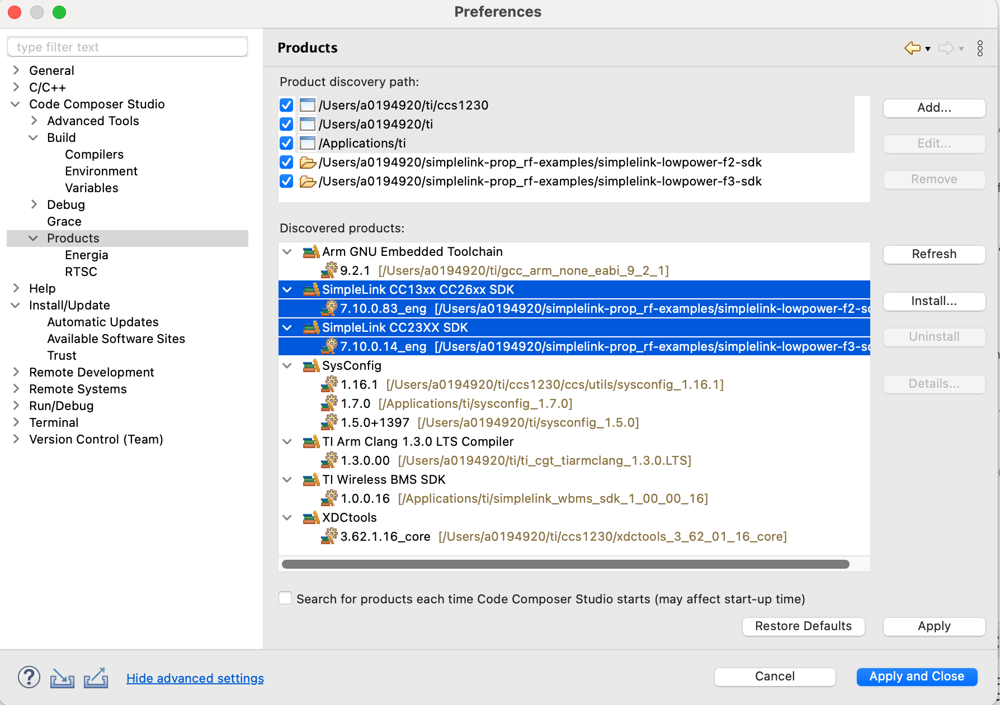
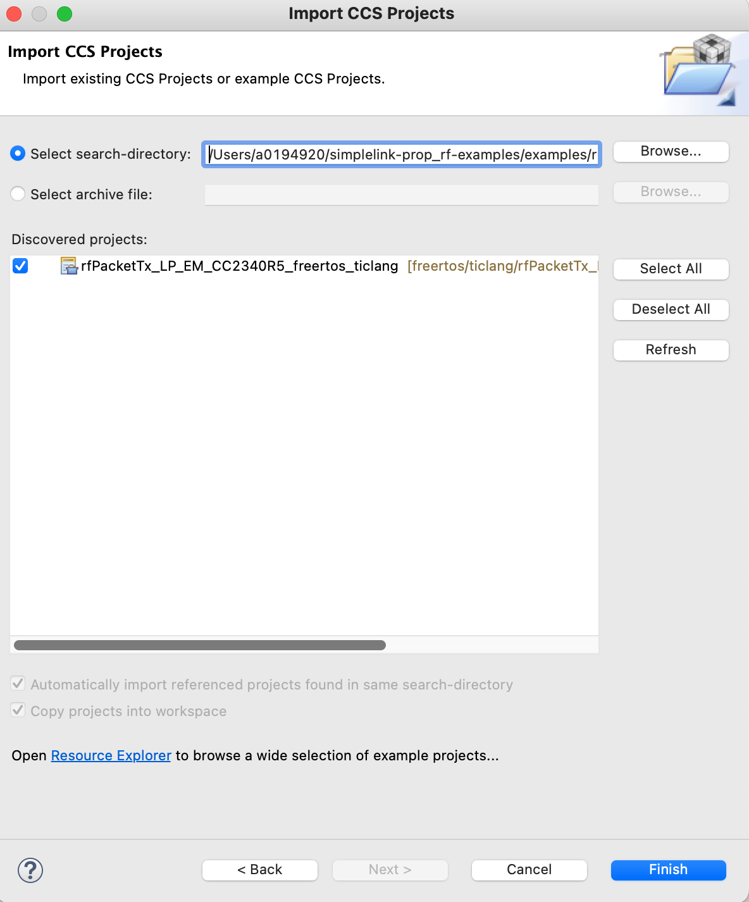
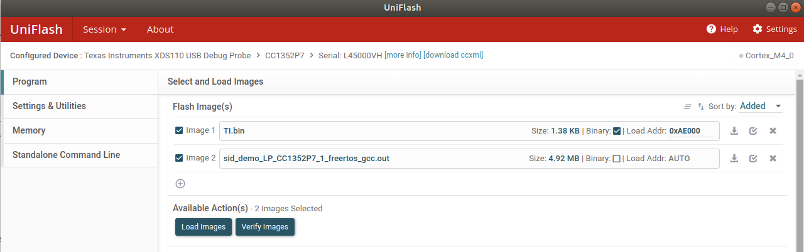
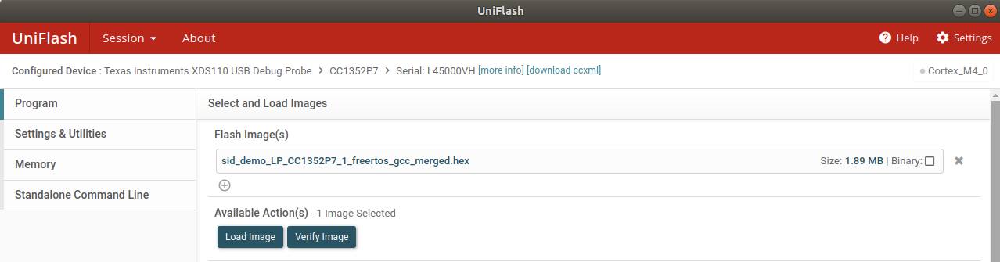

# simplelink-sidewalk-examples

This GitHub project contains the F2 sidewalk examples for Linux.  Builds are based on the 7.10 F2 SDK.  Please note the F2 repository name will change from simplelink-lowpower-f2-sdk to cc13xx_cc26xx_sdk, so it will match the name of the existing publically available F2 SDK.

## Setup Instructions

### Clone
To clone the repository and required SDK, use the following git command.

git clone --recurse-submodules https://github.com/TexasInstruments/simplelink-sidewalk-examples.git

### SDK Build
By default, the F2 SDK is included as a submodule and is the only family of SDK that needs to be built.   See [SDK/Board/Device/Association](#SDK_Association) for details. 

### Edit **imports.mak**
In the SDK subdirectory, there is a imports.mak file that is a generic sample and will not build out of the box.  This file must be updated with the tool (compilers, cmake, etc.) paths installed on your system.

For a Linux build, settings must be updated to match your build system's compiler and tool locations.  The Linux systems default Python should be fine, as most python3.6+ interpreters will work.  Please note cmake must be 3.21+.  If using CCS ccs1220, the sysconfig installed is incompatible with the SDKs.  Either upgrade CCS to ccs1230 or install sysconfig 1.16.1 from  https://www.ti.com/tool/SYSCONFIG.  See [Resources](#Resources) for URL's of tools that need installation to build the SDKs and examples.  Please note, XDC_INSTALL_DIR was required in older SDKs but no longer needed.

By default, TICLANG and GCC toolchains are enabled.  If a toolchain is unnecessary, unset the compiler, for example,  `GCC_ARMCOMPILER ?=`.

### Default imports.mak

#`XDC_INSTALL_DIR`        ?= /home/username/ti/xdctools_3_62_01_15_core (XDC not required for 7.10+ SDK's) 

`SYSCONFIG_TOOL`         ?= /home/username/ti/ccs1230/ccs/utils/sysconfig_1.16.1/sysconfig_cli.sh

`FREERTOS_INSTALL_DIR`   ?= /home/username/FreeRTOSv202104.00

`CMAKE`                 ?= /home/username/cmake-3.21.3/bin/cmake

`PYTHON`                 ?= python3

`TICLANG_ARMCOMPILER`    ?= /home/username/ti/ccs1230/ccs/tools/compiler/ti-cgt-armllvm_2.1.3.LTS-0

`GCC_ARMCOMPILER`        ?= /home/username/ti/ccs1230/ccs/tools/compiler/9.2019.q4.major-0

Edit **imports.mak** and update all of the above tool location variables to reflect the paths on your build system.

## Amazon Web Services (AWS) Account and Sample WebApp Setup
To test the examples, you need to follow the instructions outlined in the following Github page: [Amazon Sidewalk Sample IoT App](https://github.com/TexasInstruments/ti-amazon-sidewalk-sample-iot-app). It has required steps for:

1. AWS account and credentials setup
2. Amazon Sidewalk webapp deployment
3. Amazon Sidewalk device provisioning

Note that if you plan on using CCS to build the projects, you only need to setup your AWS account and credentials. This is because CCS automatically handles both Sidewalk device provisioning and Sidewalk webapp deployment for you.

## Build SDK Libraries
SDK libraries must exist before building any examples. To build SDK libraries from the simplelink-sidewalk-examples directory:

$ cd cc13xx_cc26xx_sdk/

$ make

The make will go through the SDK and build all libraries.  Depending on the build machine, the make will run for a few minutes.  Please note that simplelink-lowpower-f2-sdk/ will be renamed cc13xx_cc26xx_sdk/in the production release.

## Build Examples From Command Line
After building the SDK(s), from simplelink-sidewalk-examples cd to examples/rtos/<board_name>/ti_sidewalk/sid_demo/freertos/gcc.  Example makefiles are in examples/rtos/LP_CC2652R7/ti_sidewalk/sid_demo/freertos/gcc and examples/rtos/LP_CC1352P7_1/ti_sidewalk/sid_demo/freertos/gcc.

Example build starting from the simplelink-sidewalk-examples directory:

**$ cd examples/rtos/LP_CC1352P7_1/ti_sidewalk/sid_demo/freertos/gcc**

**$ make clean** 

**$ make**

Generating configuration files... 
Running script... 
Validating... 
: 
: 
: 
Building ti_freertos_portable_config.obj 
linking sid_demo.out 
building sid_demo.hex 

The final output from the build should be a `sid_demo.out` and `sid_demo.hex`.  

## Build Examples From CCS

Before building from CCS, the SDKs must have been built (see Build SDK Libraries), and CCS must be configured with the locations of the SDK, FreeRTOS.  THe SDK's must be built before examples will compile (see Build SDK Libraries). 
 

Add the location of simplelink-sidewalk-examples/simplelink-lowpower-f2-sdk and simplelink-sidewalk-examples/simplelink-lowpower-f3-sdk to CCS.

1. Preferences->Code Composer Studio->Products 
2. Select Add... 
3. Navigate to where simplelink-sidewalk-examples/simplelink-lowpower-f2-sdk is installed
4. Select Open.  
 
The above steps will add the SDK to the build path.  Successful addition of the SDKs will be displayed under "Discovered Products:".  Note the highlighted section under "Discovered products:".  Plesae ensure the correct version of F2 and F3 SDK's are selected as CCS may discover other SDK versions.

The location of FreeRTOS must be configured in CCS.  This is done by Preferences->Code Composer Studio->Build->Environment.  Then select Add... Add the variable name `FREERTOS_INSTALL_DIR` and set it to the absolute path of FreeRTOS on the build system.

 After re-starting CCS, File->import->Code Composer Studio->CCS Projects and press next.  From simplelink-sidewalk-examples/ navigate to examples/rtos/<board_name/ti_sidewalk/<example_name>/<rtos>. As a concrete example, navigate to **examples/rtos/LP_CC2652R7/ti_sidewalk/sid_demo**.

Press Browse, then Open.  Available examples will show up in the dialog box.  Select the example and press Finish.  After selecting Finish, the example chosen will import into your workspace.

When building with CCS there are post build steps defined in the project file that require AWS credentials. These credentials can either be set globally, in `~/.aws/config`, or it could be set on a per project basis, in `/home/username/sidewalk/sid_demo_LP_CC1352P7_1_freertos_gcc/aws_credentials/aws_credentials.yaml`

If the credentials are not set properly, the .out and .hex files will be created but the post build steps will fail.  Please see https://boto3.amazonaws.com/v1/documentation/api/latest/guide/credentials.html for information from AWS to setup credentials. 

### Example Credentials Failure
: 
/home/a0194920/simplelink-sidewalk-examples/simplelink-lowpower-f2-sdk/tools/sidewalk/web_app/bin/deploy_stack -c /home/a0194920/sidewalk/sid_demo_LP_CC1352P7_1_freertos_gcc/Debug/syscfg/ti_sidewalk_config.yaml --credentials /home/a0194920/sidewalk/sid_demo_LP_CC1352P7_1_freertos_gcc/aws_credentials/aws_credentials.yaml  
[INFO]   	Reading ti_sidewalk_config.yaml file... 
[SUCCESS]	File read successfully. 
[INFO]   	Reading config_grafana.yaml file... 
[SUCCESS]	File read successfully. 
[INFO]   	Could not find AWS credentials. Either populate the credentials.yaml file provided to this script OR use one of the methods described in https://boto3.amazonaws.com/v1/documentation/api/latest/guide/credentials.html
makefile:261: recipe for target 'post-build' failed 

## Flashing Image into the Target Device
If command line was used to build the project, the output should be `sid_demo.out` and `sid_demo.hex`. The `TI.bin` output from the Sidewalk device provisioning step must be loaded along with `sid_demo.out` or `sid_demo.hex` at location `0xAE000`

 

If CCS was used to build the project, there should be three outputs:
1. `sid_demo_<target_device_name>_freertos_gcc.out`
2. `sid_demo_<target_device_name>_freertos_gcc.hex`
3. `sid_demo_<target_device_name>_freertos_gcc_merged.hex`

The `sid_demo_<target_device_name>_freertos_gcc_merged.hex` is an image that has the main image, `sid_demo_<target_device_name>_freertos_gcc.hex`, and `TI.bin` merged together automatically by CCS. You can load this single image normally.

 

## Resources

Tools Download Locations

SysConfig (SYSCONFIG_TOOL) https://www.ti.com/tool/SYSCONFIG, or if using ccs1230+ it is part of CCS

Free RTOS (FREERTOS_INSTALL_DIR) https://github.com/FreeRTOS/FreeRTOS/releases/download/202104.00/FreeRTOSv202104.00.zip

TI CLANG Compiler (TICLANG_ARMCOMPILER) https://www.ti.com/tool/CCSTUDIO 

ARM Gnu Toolchain (GCC_ARMCOMPILER) https://developer.arm.com/tools-and-software/open-source-software/developer-tools/gnu-toolchain/gnu-rm/downloads/9-2019-q4-major

## Troubleshooting

When building on *nix platform (Linux/Mac) the library build will fail with an error similar to:

error: /Applications/Xcode.app/Contents/Developer/Toolchains/XcodeDefault.xctoolchain/usr/bin/ranlib: Unsupported triple for mach-o cpu type: thumbv6m-ti-none-eabi

To fix, make sure the arm version of ranlib is in the path before the OS version of ranlib located in /usr/bin. Simply set the location of the gcc ARM ranlib ahead in the shell's path.  Example:

export `PATH`=/Users/username/ti/gcc_arm_none_eabi_9_2_1/arm-none-eabi/bin:$PATH

## SDK_Association

[F2](simplelink_cc13xx_cc26xx_sdk.md)
