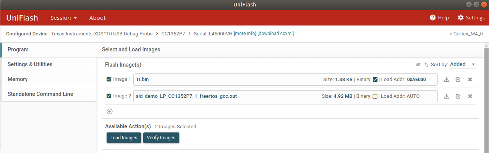
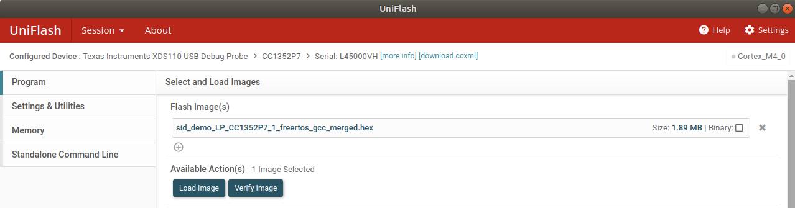

# SimpleLink ti_sidewalk Examples

This repository contains the ti_sidewalk examples for TI devices supported by the
SimpleLink Low Power F2 SDK.  To learn which devices are supported by
the SDK, refer to the [SDK Device Association section](#sdk-association).

## Repository Layout

The **examples/** directory contains the same ti_sidewalk examples provided in the
SDK, in the same directory structure.

The SimpleLink Low Power F2 SDK is provided as [Git
submodules](https://www.git-scm.com/docs/gitsubmodules) in the cc13xx_cc26xx_sdk
subdirectory.  

As a quick reference, you can initialize and update a single Git submodule in
one step like this:

```bash
# To initialize and update the F2 SDK
.../simplelink-ti_sidewalk-examples$ git submodule update --init cc13xx_cc26xx_sdk
```

Alternatively you can clone and initialize/update _all_ submodules when cloning a repo
with `git clone --recurse-submodules {repo-ref}`.  See Git documentation for
details.

Once initialized and updated, you can refer to the SDK's README.md and Release
Notes for details on how to download its dependencies, and build its libraries.

* [SimpleLink Low Power F2 SDK
  README](https://github.com/TexasInstruments/cc13xx_cc26xx_sdk/blob/main/README.md)


> Note, the links above are to online copies of the latest SDK READMEs.  They
> are useful for online readers, but be sure to consult the SDK submodule's
> _actual_ README.md after cloning, checking out your branch/tag, and updating
> your submodule, as details may change from release to release.


## Amazon Web Services (AWS) Account and Sample WebApp Setup
To test the examples, you need to follow the instructions outlined in the following Github page: [Amazon Sidewalk Sample IoT App](https://github.com/TexasInstruments/ti-amazon-sidewalk-sample-iot-app). It has required steps for:

1. AWS account and credentials setup
2. Amazon Sidewalk webapp deployment
3. Amazon Sidewalk device provisioning

Note that if you plan on using CCS to build the projects, you only need to setup your AWS account and credentials. This is because CCS automatically handles both Sidewalk device provisioning and Sidewalk webapp deployment for you.


## Setup Instructions

### Build SDK Libraries

Each time you update an SDK submodule, you will need to build its libraries.
This process _can_ vary between the different SDKs, so refer to each SDK's
README.md for specifics, but generally you will need to edit the **imports.mak**
file at the top, then run `make`.

Note that _sometimes_ the dependencies can vary from SDK to SDK.  For example,
if you've been using the F2 SDK and SysConfig version X, and want to start using
the F3 SDK, it may require a newer SysConfig version.  So, again, be sure to
refer to each SDK's README.md and Release Notes.

Often newer versions of dependencies are compatible, so you can use
newer-and-compatible versions than the SDK was validated against.  But each SDK
does have its own **imports.mak** so you _can_ specify different dependency
versions for each SDK if needed.

## Build Examples

After building the SDK libraries, you can build the ti_sidewalk examples.  The
examples support two ways to build:

* [Command line makefile](#build-examples-from-command-line)
* [CCS IDE](#build-examples-from-ccs)

### Build Examples From Command Line

Remember, before building the examples, you must build the SDK libraries!

To build a ti_sidewalk example from the command line using [GNU
make](https://www.gnu.org/software/make/manual/make.html), change into the
appropriate example's directory (e.g.
**{rtos}/{board}/ti_sidewalk/{example}/{rtos}/{toolchain}**), then run `make`.

```bash
.../simplelink-ti_sidewalk-examples$ cd examples/rtos/LP_CC1352P7_1/ti_sidewalk/sid_demo/freertos/gcc/
.../gcc$ make
```

Note, you can also clean the example with `make clean`.

### Build Examples From CCS

Remember, before building the examples, you must build the SDK libraries!

The examples also include TI Code Composer Studio (CCS) project support,
enabling them to be imported into, and built by, CCS.

Before importing the example, the SDK(s) location must be registered with CCS:

1. Preferences->Code Composer Studio->Products
2. Select Add...
3. Navigate to the SDK submodule location
4. Select Open

Repeat for each SDK you will be using.  This registers the SDK with CCS.
Successful registration of an SDK will show it in the "Discovered
Products" list:


If using FreeRTOS, its location must also be configured in CCS:

1. Preferences->Code Composer Studio->Build->Environment
2. Select Add...
3. Add the variable name `FREERTOS_INSTALL_DIR`
4. Assign it to the absolute path of your installation of FreeRTOS


Now you can import an example!

1. Project->Import CCS Project...
2. Select search-directory->Browse...
3. Navigate to a directory within your clone of the example repo to search for
   examples and Select Folder
4. Select the example(s) you wish to import and press Finish


When building with CCS there are post build steps defined in the project file that require AWS credentials. These credentials can either be set globally, in `~/.aws/config`, or it could be set on a per project basis, in `/home/username/sidewalk/sid_demo_LP_CC1352P7_1_freertos_gcc/aws_credentials/aws_credentials.yaml`

If the credentials are not set properly, the .out and .hex files will be created but the post build steps will fail.  Please see https://boto3.amazonaws.com/v1/documentation/api/latest/guide/credentials.html for information from AWS to setup credentials.

### Example Credentials Failure
:<br>
/home/<user>/simplelink-sidewalk-examples/simplelink-lowpower-f2-sdk/tools/sidewalk/web_app/bin/deploy_stack -c /home/<user>/sidewalk/sid_demo_LP_CC1352P7_1_freertos_gcc/Debug/syscfg/ti_sidewalk_config.yaml --credentials /home/<user>/sidewalk/sid_demo_LP_CC1352P7_1_freertos_gcc/aws_credentials/aws_credentials.yaml <br>
[INFO]          Reading ti_sidewalk_config.yaml file...<br>
[SUCCESS]       File read successfully.<br>
[INFO]          Reading config_grafana.yaml file...<br>
[SUCCESS]       File read successfully.<br>
[INFO]          Could not find AWS credentials. Either populate the credentials.yaml file provided to this script OR use one of the methods described in https://boto3.amazonaws.com/v1/documentation/api/latest/guide/credentials.html
makefile:261: recipe for target 'post-build' failed<br>

## Flashing Image into the Target Device
If command line was used to build the project, the output should be `sid_demo.out` and `sid_demo.hex`. The `TI.bin` output from the Sidewalk device provisioning step must be loaded along with `sid_demo.out` or `sid_demo.hex` at location `0xAE000`




<br>

If CCS was used to build the project, there should be three outputs:
1. `sid_demo_<target_device_name>_freertos_gcc.out`
2. `sid_demo_<target_device_name>_freertos_gcc.hex`
3. `sid_demo_<target_device_name>_freertos_gcc_merged.hex`

The `sid_demo_<target_device_name>_freertos_gcc_merged.hex` is an image that has the main image, `sid_demo_<target_device_name>_freertos_gcc.hex`, and `TI.bin` merged together automatically by CCS. You can load this single image normally.



<br>

## Troubleshooting

When building on *nix platform (Linux/Mac) the library build may fail with an
error similar to:

```bash
error: /Applications/Xcode.app/Contents/Developer/Toolchains/XcodeDefault.xctoolchain/usr/bin/ranlib: Unsupported triple for mach-o cpu type: thumbv6m-ti-none-eabi
```

To fix, make sure the arm version of ranlib is in the path before the OS version
of ranlib located in /usr/bin. Simply set the location of the gcc ARM ranlib
ahead in the shell's path.  Example:

```bash
$ export `PATH`=/Users/username/ti/gcc_arm_none_eabi_9_2_1/arm-none-eabi/bin:$PATH
```

## SDK Association

Click the links below to find the devices supported by each SDK.

* [SimpleLink Low Power F2 SDK devices](images/simplelink_cc13xx_cc26xx_sdk.md)
